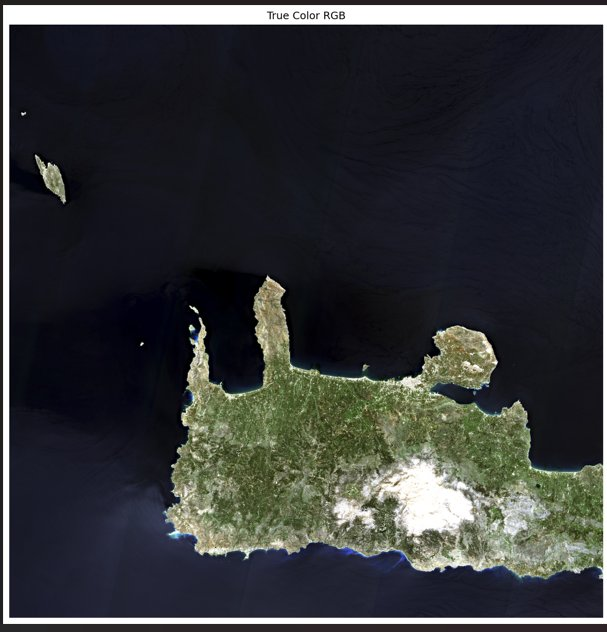
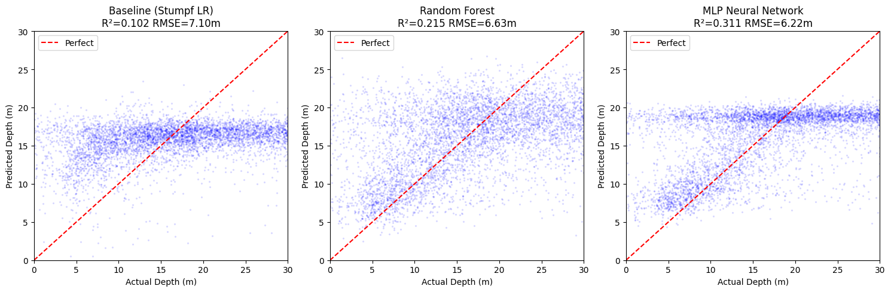
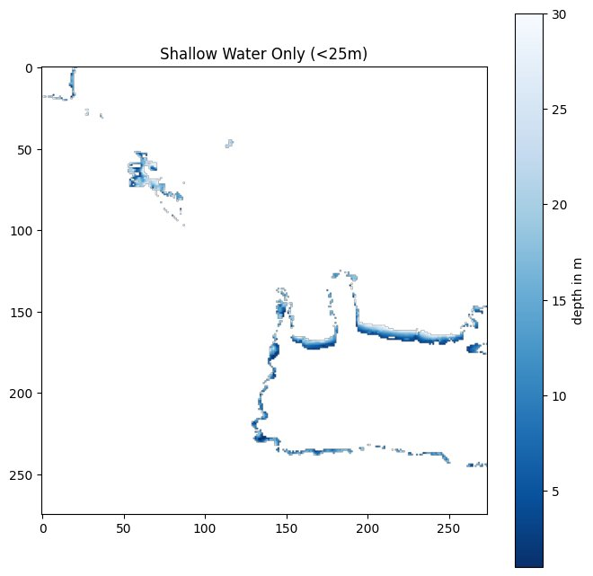

# Sentinel-2 Water Quality and Bathymetry Estimation

A satellite-based pipeline for estimating **coastal water depth** and **water quality parameters** from Sentinel-2 multispectral imagery over the south coast of Crete, Greece.

The project compares traditional spectral ratio methods against machine learning approaches (Random Forest, MLP Neural Network) for satellite-derived bathymetry (SDB), and computes water quality indices (chlorophyll-a, turbidity, NDWI) across a two-year multi-temporal dataset.

---

## Study Area

**South coast of Crete, Greece** - Sentinel-2 tile T34SGE  
Coordinate system: EPSG:32634, Resolution: 10m, Period: 2024–2025


*True color RGB composite — Sentinel-2, March 2024. Snow visible on the White Mountains (Lefka Ori). Clear Mediterranean water ideal for optical bathymetry.*

---

## Project Structure

```
sentinel2-water-quality-bathymetry/
├── notebooks/
│   ├── 01_data_download.ipynb          # Copernicus API scene search and download
│   ├── 02_preprocessing.ipynb          # Band processing, water masking, glint correction
│   └── 03_bathymetry_baseline.ipynb    # Baseline + ML bathymetry comparison
├── src/
│   ├── water_prepro_utils.py           # Full preprocessing pipeline
│   └── visualization.py               # Plotting functions
├── tests/
├── requirements.txt
├── Dockerfile
└── README.md
```

---

## Preprocessing Pipeline

Each Sentinel-2 scene goes through the following steps:

```
Raw .SAFE file
      ↓
1. Band extraction       B02 (Blue), B03 (Green), B04 (Red), B08 (NIR)
      ↓
2. DN → Reflectance      divide by 10,000 (ESA quantification value)
      ↓
3. SCL water mask        keep only SCL class 6 (water pixels)
      ↓
4. 20m → 10m resample   SCL resampled via nearest neighbour
      ↓
5. Sun glint correction  subtract 50% of NIR from visible bands
      ↓
6. Combined mask         keep only pixels valid across all bands
      ↓
7. Index calculation     NDWI, Turbidity (Dogliotti 2015), Chlorophyll (OC2)
      ↓
Save: bands.tif + indices.tif + RGB preview
```

**54 scenes processed** | ~79% valid water pixels per scene after masking

---

## Water Quality Indices

### NDWI — Normalised Difference Water Index

$$NDWI = \frac{Green - NIR}{Green + NIR}$$

Separates water from non-water surfaces. Range: −1 to +1.

### Turbidity — Dogliotti et al. (2015)

$$T = \frac{1.73 \cdot R_{red}}{1 - R_{red}/0.17}$$

Estimates suspended sediment concentration. Valid for $R_{red} < 0.17$.  
Units: NTU. Capped at 100 NTU for coastal Mediterranean waters.

### Chlorophyll-a — OC2 Algorithm (O'Reilly et al.)

$$\log_{10}(Chl_a) = 0.2424 - 2.7423 \cdot r + 1.8017 \cdot r^2$$

where $r = \log_{10}(R_{blue}/R_{green})$

Valid ratio range: −0.2 to +0.4. Units: mg/m³.


---

## Bathymetry - Methods Compared

Reference depth data: **EMODnet DTM** (~115m resolution), reprojected to match Sentinel-2 grid (EPSG:32634, 10m).

Shallow water training pixels: **94,448,695** (across 54 scenes, 0–30m depth)  
Train/test split: **80/20**, stratified by scene

### Baseline - Stumpf Band Ratio (2003)

$$ratio = \frac{\ln(Blue)}{\ln(Green)}$$

$$depth = m_0 + m_1 \cdot ratio$$

Linear regression calibrated against EMODnet reference depth.


### Machine Learning Models

**Random Forest** — 100 trees, trained on 1M sampled pixels  
Input features: B02, B03, B04 reflectance values per pixel

**MLP Neural Network** — architecture: 3 → 64 → 32 → 16 → 1  
Activation: ReLU | Scaled inputs (StandardScaler)

---

## Results


*Predicted vs actual depth scatter plots. Red dashed line = perfect prediction. Each point = one test pixel.*

| Model | R² | RMSE (m) | MAE (m) |
|---|---|---|---|
| Stumpf Band Ratio (baseline) | 0.102 | 7.10 | 5.87 |
| Random Forest | 0.215 | 6.63 | 5.15 |
| **MLP Neural Network** | **0.311** | **6.22** | **4.82** |

**MLP improved R² by 21% and reduced RMSE by 0.88m over the traditional baseline.**

### Feature Importance (Random Forest)

| Band | Importance |
|---|---|
| B02 Blue | 0.277 |
| B03 Green | 0.415 |
| B04 Red | 0.308 |

Green band shows highest importance — consistent with optical depth theory (green light penetrates deepest in clear water).

### Discussion

Low overall R² values are attributed to:

- **Resolution mismatch** — EMODnet reference at 115m vs Sentinel-2 at 10m creates label noise. One EMODnet pixel covers ~121 Sentinel-2 pixels, all assigned the same depth value.
- **Optical complexity** — coastal Mediterranean water exhibits variable turbidity and bottom type that reduces band ratio reliability.
- **Depth range** — the 0–30m range includes transitional zones where optical properties change non-linearly.

Higher-resolution reference data (airborne LiDAR, multibeam sonar) would be expected to significantly improve model accuracy.

---

## Shallow Water Coverage


*EMODnet depth < 30m around Crete south coast. Coastal shelves and island shallow zones clearly visible.*

---

## Setup

```bash
git clone https://github.com/harisankar1320/sentinel2-water-quality-bathymetry.git
cd sentinel2-water-quality-bathymetry

python -m venv venv
venv\Scripts\activate          # Windows
source venv/bin/activate       # Mac/Linux

pip install -r requirements.txt
```

### Data Requirements

- Sentinel-2 L2A scenes from [Copernicus Data Space](https://dataspace.copernicus.eu/) — tile T34SGE
- EMODnet bathymetry DTM from [EMODnet Bathymetry Portal](https://emodnet.ec.europa.eu/en/bathymetry)

---

## Dependencies

```
numpy
rasterio
scikit-learn
matplotlib
requests
python-dotenv
```

---

## References

- Stumpf, R.P. et al. (2003). *Determination of water depth with high-resolution satellite imagery over variable bottom types*. Limnology and Oceanography.
- Dogliotti, A.I. et al. (2015). *A single algorithm to retrieve turbidity from remotely-sensed data in all coastal and estuarine waters*. Remote Sensing of Environment.
- O'Reilly, J.E. et al. (1998). *Ocean color chlorophyll algorithms for SeaWiFS*. Journal of Geophysical Research.
- EMODnet Bathymetry Consortium (2022). *EMODnet Digital Bathymetry (DTM)*. European Marine Observation and Data Network.

---

## Author

**Harisankar Harikumar**  
MSc Remote Sensing and Geoinformatics  
Karlsruhe Institute of Technology (KIT)  
[GitHub](https://github.com/harisankar1320)
